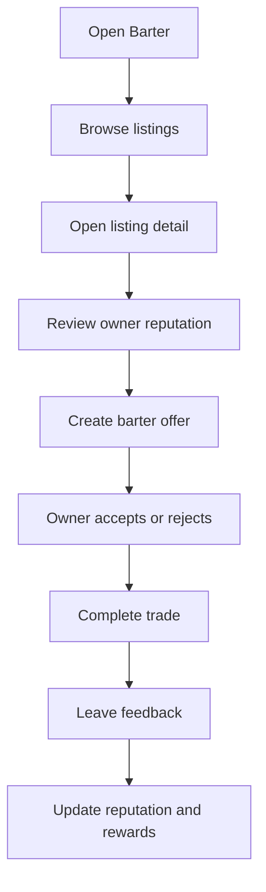

# Barter Product Requirements

This document describes the intended product direction for Barter. It is not a description of completed functionality.

The current codebase is a Flutter scaffold with the starter counter app in `lib/main.dart`. The requirements below are product goals that should guide future implementation.

## Scope Summary

| Area | Current codebase status |
| --- | --- |
| App shell | Flutter starter app exists |
| Product UI | Not implemented |
| User accounts | Not implemented |
| Listings | Not implemented |
| Trades | Not implemented |
| Avatar progression | Not implemented |
| Rewards and achievements | Not implemented |
| Reputation | Not implemented |
| Chat or community features | Not implemented |
| Marketplace auctions | Not implemented |
| Backend/API | Not implemented |
| Database/persistence | Not implemented |
| Security controls | Not implemented |

## Product Goal

Barter should become a gamified marketplace for exchanging goods and services. The product should make direct exchange feel trustworthy, engaging, and community-oriented by combining:

- Listings for goods and services.
- Direct barter offers.
- Reputation and feedback after completed exchanges.
- Avatar customization and progression.
- Points, rewards, badges, or achievements.
- Community interaction and moderation.
- Safer trading mechanisms such as verification, dispute handling, and fraud prevention.

## Target Users

| User group | Need |
| --- | --- |
| Individual traders | Exchange goods or services without relying only on cash transactions. |
| Collectors and hobbyists | Trade niche items and build identity through progression or avatars. |
| Service providers | Offer skills or services in exchange for goods, credits, or other services. |
| Trust-conscious users | Evaluate other traders through verification, ratings, history, and reputation. |
| Community moderators | Review reports, resolve disputes, and help keep the marketplace safe. |

## Product Principles

- Barter should make trust visible before a user commits to a trade.
- The core exchange flow should be understandable without requiring financial-market or auction expertise.
- Gamification should support real marketplace behavior, not distract from trade safety.
- Reputation should be earned from completed interactions and peer feedback.
- Security and moderation should be designed before high-value trades, escrow, or payment-like behavior is introduced.

## MVP Definition

The first meaningful MVP should replace the starter counter app with a small but coherent marketplace loop.

### MVP In Scope

| Feature | Description | Status |
| --- | --- | --- |
| Product shell | Branded home screen and navigation for the Barter concept. | Planned |
| Profile stub | Basic user profile surface with display name, reputation placeholder, and avatar placeholder. | Planned |
| Listing browser | Browse a small set of goods or services. | Planned |
| Listing detail | View listing title, description, category, owner, and requested exchange. | Planned |
| Offer flow | Start a proposed barter offer from a listing. | Planned |
| Trade status | Represent pending, accepted, completed, and disputed trade states. | Planned |
| Reputation placeholder | Display reputation concepts without claiming real trust scoring until data exists. | Planned |
| Basic widget tests | Test the first real user-visible flow. | Planned |

### MVP Out of Scope

These features should not be presented as complete until corresponding code, data, and security models exist:

- Real authentication.
- Real identity verification.
- Escrow.
- Payment handling.
- Real-time chat.
- Push notifications.
- Auctions with live bidding.
- Moderation queues.
- Fraud detection.
- Social media integrations.
- Multi-language support.

## Functional Requirements

### Profiles and Identity

| ID | Requirement | Priority | Status |
| --- | --- | --- | --- |
| BTR-PROFILE-001 | Users should have a profile with display name, avatar, basic trade history, and reputation summary. | High | Planned |
| BTR-PROFILE-002 | Users should be able to customize avatar appearance. | Medium | Planned |
| BTR-PROFILE-003 | Avatar items should be unlockable through product milestones. | Medium | Planned |
| BTR-PROFILE-004 | Identity verification should be designed before trust badges or high-value trade support are released. | High | Planned |

### Listings

| ID | Requirement | Priority | Status |
| --- | --- | --- | --- |
| BTR-LISTING-001 | Users should be able to create listings for goods or services. | High | Planned |
| BTR-LISTING-002 | Listings should include title, description, category, owner, condition or service scope, and desired exchange. | High | Planned |
| BTR-LISTING-003 | Users should be able to browse and filter listings. | High | Planned |
| BTR-LISTING-004 | Users should be able to view listing details before starting a trade offer. | High | Planned |

### Trades and Offers

| ID | Requirement | Priority | Status |
| --- | --- | --- | --- |
| BTR-TRADE-001 | Users should be able to propose a barter offer for a listing. | High | Planned |
| BTR-TRADE-002 | A trade should support clear states such as pending, accepted, rejected, completed, canceled, and disputed. | High | Planned |
| BTR-TRADE-003 | Users should be able to review trade details before accepting. | High | Planned |
| BTR-TRADE-004 | Completed trades should be eligible for feedback and reward progress. | Medium | Planned |

### Reputation and Feedback

| ID | Requirement | Priority | Status |
| --- | --- | --- | --- |
| BTR-REP-001 | Users should be able to rate each other after completed trades. | High | Planned |
| BTR-REP-002 | Profiles should show reputation in a way that is visible but not misleading. | High | Planned |
| BTR-REP-003 | Reputation should consider completed trades and peer feedback. | Medium | Planned |
| BTR-REP-004 | Reputation rules should be documented before they affect user trust decisions. | High | Planned |

### Rewards and Progression

| ID | Requirement | Priority | Status |
| --- | --- | --- | --- |
| BTR-REWARD-001 | Users should receive points or progress for completed trades. | Medium | Planned |
| BTR-REWARD-002 | Users should earn badges or achievements for meaningful milestones. | Medium | Planned |
| BTR-REWARD-003 | Reward mechanics should not incentivize spam, fake trades, or abusive behavior. | High | Planned |

### Community and Communication

| ID | Requirement | Priority | Status |
| --- | --- | --- | --- |
| BTR-COMM-001 | Users should have a way to discuss trades or ask listing questions. | Medium | Planned |
| BTR-COMM-002 | Community areas should have moderation rules before public launch. | High | Planned |
| BTR-COMM-003 | Social sharing should be optional and should not expose private trade data. | Medium | Planned |

### Marketplace and Auctions

| ID | Requirement | Priority | Status |
| --- | --- | --- | --- |
| BTR-MARKET-001 | The marketplace should support browsing listings by category. | High | Planned |
| BTR-MARKET-002 | Auction behavior may be explored after the direct barter flow works. | Low | Planned |
| BTR-MARKET-003 | Auctions should not be implemented without clear bidding, notification, abuse, and dispute rules. | High | Planned |

### Safety and Moderation

| ID | Requirement | Priority | Status |
| --- | --- | --- | --- |
| BTR-SAFE-001 | Users should be able to report suspicious listings, profiles, or trades. | High | Planned |
| BTR-SAFE-002 | Dispute handling should be represented before completed trade reputation becomes meaningful. | High | Planned |
| BTR-SAFE-003 | Identity verification, escrow, or payment-like workflows require a dedicated security design before implementation. | High | Planned |
| BTR-SAFE-004 | Sensitive user data should not be collected until storage, privacy, and retention rules are defined. | High | Planned |

## Conceptual Domain Model

No domain classes, database schema, API contracts, or persistent storage exist in the current codebase.

The following entities are conceptual requirements for future design:

| Entity | Responsibility |
| --- | --- |
| User | Represents a person using the marketplace. |
| Profile | Stores public display information, avatar, reputation summary, and trade history. |
| Listing | Represents a good or service available for barter. |
| Offer | Represents a proposed exchange against a listing. |
| Trade | Represents the lifecycle of an accepted exchange. |
| Feedback | Represents post-trade rating and comments. |
| Reward | Represents points, badges, achievements, or unlocks. |
| AvatarItem | Represents customization assets earned or selected by users. |
| Dispute | Represents a safety or moderation case tied to a trade. |
| Auction | Represents an optional future competitive listing format. |

## Main User Flow

The intended direct barter flow is:

This flow is not implemented yet.

## Quality Requirements

| Quality attribute | Requirement |
| --- | --- |
| Usability | The trade flow should be short, legible, and understandable for first-time users. |
| Reliability | Trade state changes should be durable and auditable once persistence exists. |
| Performance | Listing browsing and profile surfaces should remain responsive on mobile devices. |
| Security | Trust, verification, dispute, and reputation features must not be simulated as real protections. |
| Maintainability | Product code should be separated into clear UI, domain, state, and data layers when the app grows beyond `lib/main.dart`. |
| Compatibility | Flutter platform support should be narrowed or validated before claiming production support across all generated platforms. |
| Accessibility | Core flows should support readable text, touch targets, semantic labels, and keyboard/screen reader paths where platform-relevant. |

## A/B Testing Candidates

A/B testing should only happen after the product has real usage surfaces and instrumentation.

Potential future tests:

| Experiment | Version A | Version B | Primary metric |
| --- | --- | --- | --- |
| Offer creation | Compact offer form | Guided step-by-step offer flow | Completed offer rate |
| Avatar progression | Simple badge unlocks | Visual avatar item unlocks | Return visits after completed trade |
| Trust display | Numeric reputation score | Reputation summary with recent feedback | Offer acceptance rate |
| Listing discovery | Category-first browsing | Search-first browsing | Listing detail views |

## Open Decisions

These decisions are not identified in the current codebase:

- TODO: not identified in the current codebase - whether the MVP should use a real backend, local mock data, or static demo data.
- TODO: not identified in the current codebase - authentication provider or account model.
- TODO: not identified in the current codebase - database technology.
- TODO: not identified in the current codebase - state management approach.
- TODO: not identified in the current codebase - moderation workflow.
- TODO: not identified in the current codebase - escrow, payment, or third-party verification provider.
- TODO: not identified in the current codebase - release targets and deployment process.

## Documentation Triggers

Additional documentation should be created only when the corresponding implementation exists:

- Add `docs/architecture.md` after the app has meaningful UI, state, domain, and data layers.
- Add `docs/api.md` only after backend endpoints, server actions, SDK methods, or external API contracts exist.
- Add `docs/database.md` only after persistent storage, migrations, schemas, or models exist.
- Add `docs/security.md` only after authentication, authorization, verification, moderation, or sensitive data handling exists.
- Add `docs/deployment.md` only after deployment targets, CI/CD, release scripts, or hosting configuration exist.
